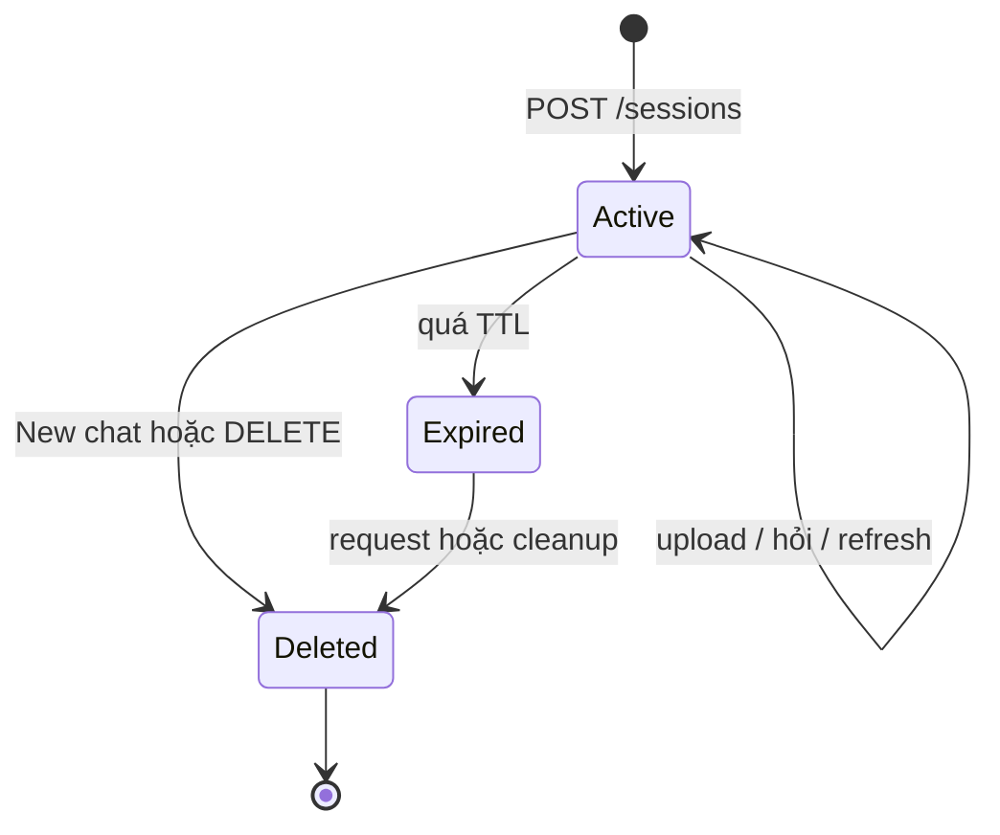

# Kiến trúc và quản lý phiên

## Áp dụng kiến thức từ `Lap_trinh_mang_v3.pdf`

- HTTP là stateless, từng request không tự biết request trước (trang PDF 235). Vì vậy mọi upload/câu hỏi đều mang `session_id`.
- FTP tách kết nối điều khiển tồn tại trong phiên khỏi kết nối dữ liệu tạm (trang PDF 248). Tương tự, state phiên nằm bền trong SQLite; upload là luồng dữ liệu hữu hạn và file tạm bị xóa sau indexing.
- Thiết kế giao thức cần xác định có session-based hay không; ví dụ chat dùng JOIN, MSG, QUIT (trang PDF 262–274). API này ánh xạ thành tạo phiên, hỏi và đóng phiên.

Đây là session logic ở tầng ứng dụng HTTP, không phải giữ một TCP connection mở.

Frontend giữ UUID trong `localStorage`. `GET /sessions/{id}` khôi phục file và chat. Mỗi request hợp lệ gia hạn TTL; task nền dọn phiên theo `SESSION_CLEANUP_INTERVAL_SECONDS`. Khi xóa, backend xóa Chroma trước rồi SQLite cascade documents/messages.

UUID là định danh phiên demo, chưa phải đăng nhập. Khi triển khai công khai, cần gắn phiên với user đã xác thực hoặc dùng cookie HttpOnly đã ký.

## Ranh giới tầng

| Tầng | Trách nhiệm | Breakpoint phù hợp |
|---|---|---|
| `api/routers` | HTTP, multipart/JSON, status code | `documents.py`, `chat.py` |
| `clients/ollama_client.py` | HTTP local, retry, validate API Ollama | `_request`, `embed`, `chat` |
| `session_service.py` | TTL, giới hạn, xóa phiên | `require_active`, `_purge` |
| `document_parser.py` | File → `(page, text)` | `parse` |
| `chunking_service.py` | Text → chunk có trang/Điều | `chunk_pages` |
| `indexing_service.py` | parse → chunk → embed → save | `index_file` |
| `rag_service.py` | retrieve, threshold, context, history | `ask` |
| `generation_service.py` | prompt grounded, retry | `generate` |
| `repositories` | SQLite/Chroma CRUD | `query`, `upsert`, CRUD |

Một file lỗi không làm mất file khác cùng request. Trạng thái là `processing → ready` hoặc `processing → failed`; vector dở dang của file lỗi bị rollback. Chroma query luôn lọc `session_id`, sau đó bỏ đoạn dưới `MIN_SIMILARITY` và đoạn gần trùng.

## Ranh giới model provider

- `OllamaClient` gọi API native tại `OLLAMA_BASE_URL`; không dùng khóa bí mật hay OpenAI SDK.
- Cả `embed_texts()` khi indexing và `embed_query()` khi hỏi đều dùng cùng `EMBEDDING_MODEL=bge-m3`.
- `GenerationService` dùng `OLLAMA_GENERATION_MODEL=qwen3:4b` qua `/api/chat` để sinh câu trả lời có trích nguồn.
- `IndexingService` và `RagService` không biết chi tiết provider; chúng chỉ phụ thuộc vào giao diện của hai service trên.

Không được trộn vector của hai embedding model. Khi đổi `EMBEDDING_MODEL`, phải đổi `CHROMA_COLLECTION_NAME`, tạo phiên mới và upload lại tài liệu. `MIN_SIMILARITY` cũng cần được đánh giá lại bằng bộ câu hỏi thật.
