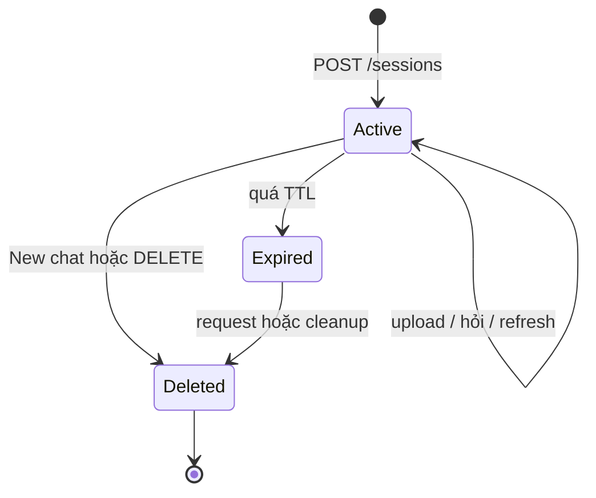
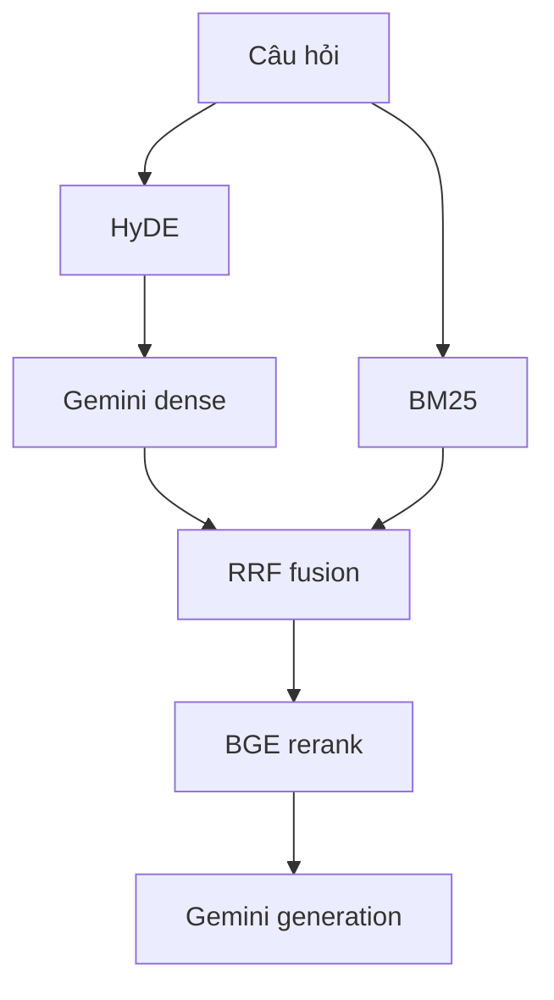

# Kiến trúc và quản lý phiên
- HTTP là stateless, từng request không tự biết request trước (trang PDF 235). Vì vậy mọi upload/câu hỏi đều mang `session_id`.
- FTP tách kết nối điều khiển tồn tại trong phiên khỏi kết nối dữ liệu tạm (trang PDF 248). Tương tự, state phiên nằm bền trong SQLite; upload là luồng dữ liệu hữu hạn và file tạm bị xóa sau indexing.
- Thiết kế giao thức cần xác định có session-based hay không; ví dụ chat dùng JOIN, MSG, QUIT (trang PDF 262–274). API này ánh xạ thành tạo phiên, hỏi và đóng phiên.

Đây là session logic ở tầng ứng dụng HTTP, không phải giữ một TCP connection mở.

```mermaid
stateDiagram-v2
    [*] --> Active: POST /sessions
    Active --> Active: upload / hỏi / refresh
    Active --> Expired: quá TTL
    Active --> Deleted: New chat hoặc DELETE
    Expired --> Deleted: request hoặc cleanup
    Deleted --> [*]
```

Frontend giữ UUID trong `localStorage`. `GET /sessions/{id}` khôi phục file và chat. Mỗi request hợp lệ gia hạn TTL; task nền dọn phiên theo `SESSION_CLEANUP_INTERVAL_SECONDS`. Khi xóa, backend xóa Chroma trước rồi SQLite cascade documents/messages.

UUID là định danh phiên demo, chưa phải đăng nhập. Khi triển khai công khai, cần gắn phiên với user đã xác thực hoặc dùng cookie HttpOnly đã ký.

## Ranh giới tầng

| Tầng | Trách nhiệm | Breakpoint phù hợp |
|---|---|---|
| `api/routers` | HTTP, multipart/JSON, status code | `documents.py`, `chat.py` |
| `clients/ollama_client.py` | HTTP local, retry, validate API Ollama | `_request`, `embed`, `chat` |
| `session_service.py` | TTL, giới hạn, xóa phiên | `require_active`, `_purge` |
| `document_parser.py` | File → `(page, text)` | `parse` |
| `chunking_service.py` | Text → chunk có trang/Điều | `chunk_pages` |
| `indexing_service.py` | parse → chunk → embed → save | `index_file` |
| `rag_service.py` | retrieve, threshold, context, history | `ask` |
| `generation_service.py` | prompt grounded, retry | `generate` |
| `repositories` | SQLite/Chroma CRUD | `query`, `upsert`, CRUD |

Một file lỗi không làm mất file khác cùng request. Trạng thái là `processing → ready` hoặc `processing → failed`; vector dở dang của file lỗi bị rollback. Chroma query luôn lọc `session_id`, sau đó bỏ đoạn dưới `MIN_SIMILARITY` và đoạn gần trùng.

## Ranh giới tầng

| Tầng | Trách nhiệm | Breakpoint phù hợp |
|---|---|---|
| `api/routers` | HTTP, multipart/JSON, status code | `documents.py`, `chat.py` |
| `clients/gemini_client.py` | Google Gen AI SDK, retry, validate/normalize | `embed`, `generate` |
| `session_service.py` | TTL, giới hạn, xóa phiên | `require_active`, `_purge` |
| `document_parser.py` | File → `(page, text)` | `parse` |
| `chunking_service.py` | Text → chunk có trang/Điều | `chunk_pages` |
| `indexing_service.py` | parse → chunk → embed → save | `index_file` |
| `query_rewrite_service.py` | tạo HyDE, fallback về câu hỏi gốc | `rewrite` |
| `hybrid_retrieval_service.py` | dense + BM25 + RRF | `retrieve` |
| `reranking_service.py` | lazy-load CrossEncoder, rerank | `rerank` |
| `rag_service.py` | rewrite, retrieve, deduplicate, context, history | `ask` |
| `generation_service.py` | prompt grounded | `generate` |
| `repositories` | SQLite/Chroma CRUD | `query`, `upsert`, CRUD |

Một file lỗi không làm mất file khác cùng request. Trạng thái là
`processing → ready` hoặc `processing → failed`; vector dở dang của file lỗi
bị rollback. Chroma và BM25 đều luôn lọc theo `session_id`.

## Ranh giới model provider

- `GeminiClient` lấy key từ `GEMINI_API_KEY`, không đọc Colab Secrets.
- Tài liệu dùng task type `RETRIEVAL_DOCUMENT`; HyDE dùng `RETRIEVAL_QUERY`.
- `gemini-embedding-001` xuất 768 chiều và được chuẩn hóa L2 thủ công.
- `GenerationService` và HyDE dùng `GEMINI_GENERATION_MODEL`.
- `IndexingService` và `RagService` không biết chi tiết provider; chúng chỉ phụ thuộc vào giao diện của hai service trên.

```mermaid
flowchart TD
    Q["Câu hỏi"] --> H["HyDE"]
    H --> D["Gemini dense"]
    Q --> B["BM25"]
    D --> F["RRF fusion"]
    B --> F
    F --> R["BGE rerank"]
    R --> G["Gemini generation"]
```

HyDE chỉ đi vào nhánh dense. BM25 và CrossEncoder dùng câu hỏi gốc để giữ
từ khóa pháp lý. Nếu HyDE lỗi, dense dùng câu hỏi gốc; nếu reranker lỗi,
pipeline vẫn trả kết quả theo RRF.

Nhiều file trong cùng một chat chưa cần query routing: cả hai nhánh truy hồi
đã giới hạn theo `session_id` và chấm điểm trên toàn bộ chunks của các file
đó. Chỉ nên thêm router khi ứng dụng có nhiều kho/miền dữ liệu tách biệt hoặc
cần chọn công cụ khác nhau trước khi truy hồi.

Không được trộn vector của hai embedding model/số chiều. Khi đổi
`EMBEDDING_MODEL` hoặc `EMBEDDING_DIMENSION`, phải đổi
`CHROMA_COLLECTION_NAME`, tạo phiên mới và upload lại tài liệu.
